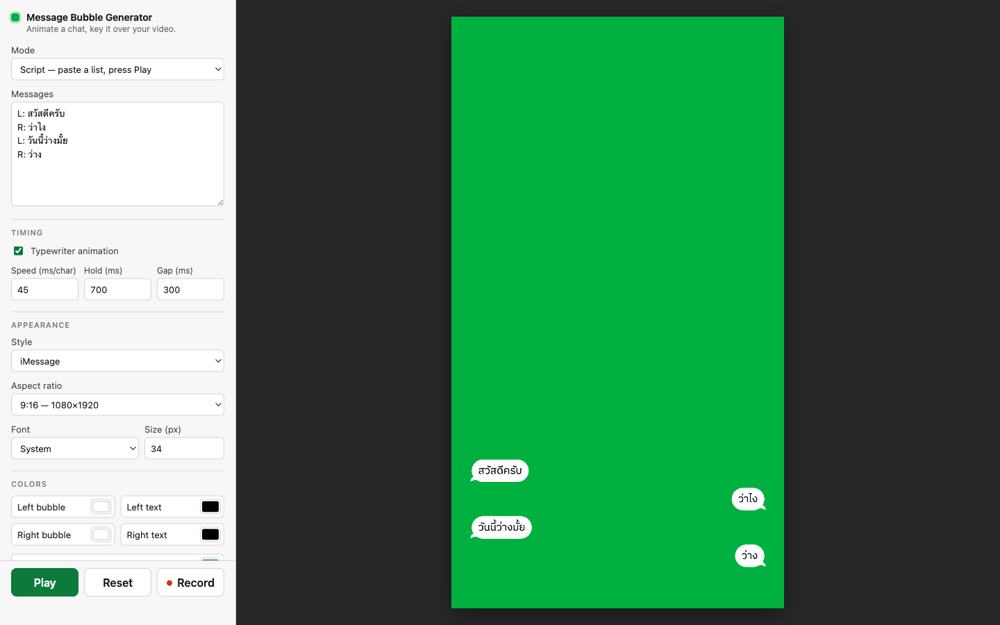
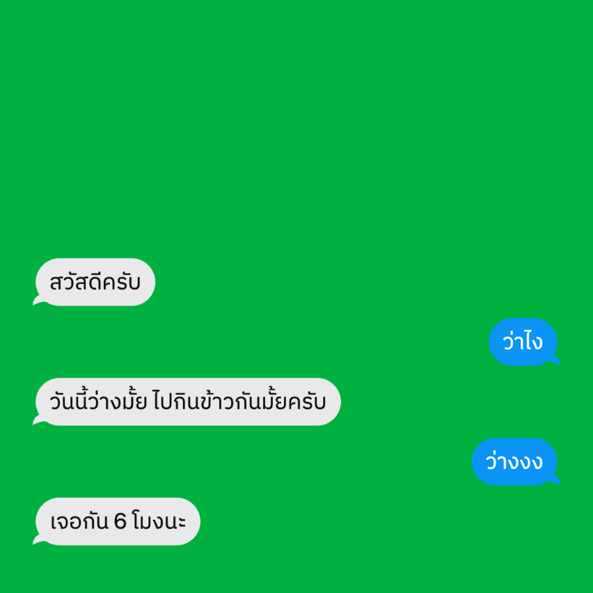
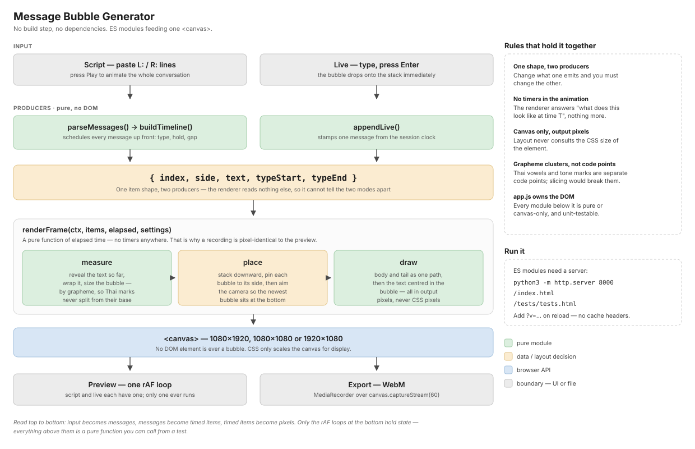

# Message Bubble Generator

Animates a chat conversation on a chroma-key background so you can key it into
a video, and exports the result as a WebM file. Each message types itself in
one grapheme at a time, its bubble growing to fit as it goes, while the
conversation stack hangs off the bottom of the frame and eases upward as new
bubbles arrive.

No build step, no package manager, no dependencies — it is plain ES modules,
HTML, and a `<canvas>`.

## What comes out

The stage is the export. Every bubble is drawn on the canvas at the output
resolution — nothing is a DOM element — so a recording is pixel-identical to
the preview.

## Two modes

- **Script** — paste a list of `L:`/`R:` prefixed lines into the textarea and
  press Play to animate the whole conversation on a timeline you can record.
  An unprefixed line continues the previous message.
- **Live** — type into the message box and press Enter to drop a bubble onto
  the stack immediately, one message at a time; useful for narrating a
  conversation while recording. Tab inside the input flips the side.

Both modes feed the same renderer, so they look identical.

## Settings

The panel groups the controls under **Timing**, **Appearance**, and
**Colors**, with Play, Reset, and Record pinned to the bottom.

| Setting | Group | What it does |
| --- | --- | --- |
| Typewriter animation | Timing | Off makes each bubble appear complete, with no reveal |
| Humanize (%) | Timing | Unevenness in the typing: keys land early or late, with a beat after punctuation and the odd hesitation. 0 is a perfectly regular reveal. The message still finishes at the same moment either way |
| Speed (ms/char) | Timing | Milliseconds per grapheme; total type time is `graphemes × this`, uncapped |
| Hold (ms) | Timing | Pause once a message is fully typed |
| Gap (ms) | Timing | Pause before the next message starts typing |
| Typing sound | Timing | Plays a synthesised keyboard click per grapheme, and muxes it into the recording |
| Volume | Timing | 0–100, applied to the clicks; 0 is silent |
| Style | Appearance | `iMessage` (pill + tail), `LINE` (rounded, optional sender name), `Minimal` |
| Sender name | Appearance | Drawn above left-side bubbles; only the LINE style renders it, so the field appears only for that style |
| Aspect ratio | Appearance | 9:16 (1080×1920), 1:1 (1080×1080), or 16:9 (1920×1080) |
| Font | Appearance | The family, and the size in output pixels |
| Bubble and text colours | Colors | Per-side bubble and text colour |
| Stage background | Colors | The background key colour |
| Transparent | Colors | Skips the background fill so the WebM carries alpha instead of a key colour |

## Running

ES modules are blocked over `file://`, so serve the folder:

    python3 -m http.server 8000

Then open <http://localhost:8000/index.html>.

The server sends no cache headers, so append a unique query string
(`?v=anything`) when reloading after a change — otherwise the browser will hand
you the stale page.

## Recording

Press Record. The button turns red and reads Stop while capture is running. In
Script mode the recording stops itself when playback ends; in Live mode it runs
until you press Stop. The file downloads as WebM at the selected resolution.

With **Typing sound** ticked the WebM also carries an Opus audio track of the
clicks. With it unticked the file has no audio track at all, rather than a
silent one. The clicks are scheduled from the same elapsed time the renderer
draws from, so they land on the frames their characters appear on — what you
hear in the preview is what ends up in the file.

## Tests

Open <http://localhost:8000/tests/tests.html>. The page runs the unit tests for
the parser, the timeline, live-mode item building, text measurement/wrapping,
the reveal curve, and the typing-sound click schedule, then prints
`N passed, M failed` plus one line per test.

Rendering, camera movement, audio synthesis, and WebM export have no automated
coverage by design; they are verified by hand against the checklist below.

## Manual checks before shipping a change

1. Unit tests pass at `/tests/tests.html`.
2. Parser: prefixed lines, unprefixed continuation, blank lines, prefix-only
   lines, and mixed-case prefixes all behave.
3. Timing: typing duration is `graphemes × msPerChar` with no clamp — a
   5-character message at 100ms/char takes about half a second, and a
   200-character message at the same rate takes proportionally longer, not a
   capped amount.
4. Wrapping: a long English sentence and a long unspaced Thai sentence both
   stay inside their bubbles, with no broken glyph flashing mid-type.
5. Camera: a twelve-message conversation keeps the newest bubble in frame,
   with the oldest scrolling off the top.
6. Export: a recorded WebM opens (or decodes, e.g. via a `<video>` element)
   at the selected resolution and its frames match the preview.
7. Live mode: typing a message and pressing Enter drops the bubble onto the
   stack; a second Enter stacks the next bubble below it without disturbing
   the first.
8. Live mode: the side toggle flips by click and by pressing Tab inside the
   input, and the chosen side persists across several messages.
9. Turning typing animation off makes bubbles appear immediately (script and
   live), with no indicator.
10. Enough live messages to overflow the stage keep the newest bubble in
    frame; Clear empties the stack and resets the camera.
11. Record in Live mode runs until Stop is pressed; Record in Script mode
    stops itself when playback ends.
12. Switching modes back and forth leaves neither mode's animation running in
    the background.
13. No three-dot "typing indicator" appears anywhere, in either mode — text
    types in one character at a time and the bubble grows to fit as it does.
14. The first bubble sits at the bottom of the stage on the very first frame,
    with nothing sliding up into place on load; each new bubble afterward
    eases the stack upward.
15. At a narrow or short browser window, the canvas scales down to fit the
    stage instead of being clipped.
16. Bubble text is optically centred in its bubble — equal space above and
    below a single line — and Thai vowels and tone marks are not clipped by
    the bubble's top edge.
17. In iMessage style, the tail stays welded to the bubble at every message
    length, including a one-character bubble and a bubble wide enough to
    reach the wrap width.
18. Typing sound: with the box ticked, clicks are audible during playback and
    during live typing, and land with the characters rather than trailing
    them. Volume 0 is silent. Unticking it hides the volume field.
19. Typing sound in the export: a WebM recorded with the box ticked carries an
    Opus track whose clicks line up with the typing; one recorded with it
    unticked carries no audio track at all. Record twice in a row with sound
    on — the second file must still have audio.
20. Humanize: at 0 the reveal is perfectly regular; at 40 keys land unevenly,
    with a beat after punctuation. Either way the message finishes at the same
    moment, and the clicks stay on the characters. Turning the typewriter off
    hides the field.
21. Replay determinism: play the same script twice at the same Humanize, and
    the characters land on the same frames both times — no flicker of a
    grapheme appearing and vanishing.

## Architecture

`app.js` is the only module that touches the DOM; everything below it is pure
or canvas-only. Design history lives in `docs/superpowers/`. Notes for anyone
(human or agent) changing this code are in `CLAUDE.md`.
